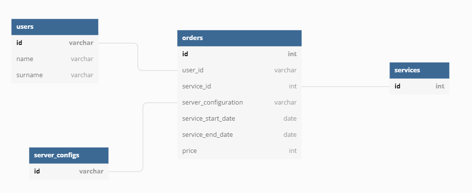

# CSV To Postgres ETL Pipeline

## Общая информация

Этот ETL пайплайн служит для доставки данных из csv файла до таблиц в
PostgreSQL DB

Упрощённый алгоритм:

1. Извлечь данные по заказам из csv файла
2. Провести обработку данных
3. Записать данные в отдельные таблицы в соответствии с нормализованной структурой ниже

## Структура схемы в БД

## Подготовка к запуску

Клонируйте репозиторий к себе на локальную машину

по SSH:

    git clone git@github.com:Lightblash/etl-users-orders.git

или по HTTPS:

    git clone https://github.com/Lightblash/etl-users-orders.git

Создадим новое виртуальное окружение, чтоб туда установить необходимые библиотеки (команды для создания виртуального окружения зависят от ОС и менеджера по виртуальным окружениям)

    virtualenv --python=python3.7 env

Активируем виртуальное окружение

    source env/bin/activate

Установим необходимые зависимости

    pip install -r requirements.txt

Для подключения к БД нужно указать креды. Для этого нужно создать файл `config.ini` и заполнить его в соответствии с шаблоном `config_example.ini`

## Как использовать

Для получения информации о параметрах запуска, запустим хелп:

    python etl.py --help

Вывод

    usage: etl.py [-h] [--db_config DB_CONFIG] [--csv_file CSV_FILE] [--first_run]
              [--log LOG] [--log-level {debug,info,warning,error,critical}]

    ETL pipeline is used for deliver orders data from csv file to Postgres DB
    tables

    optional arguments:
    -h, --help            show this help message and exit
    --db_config DB_CONFIG
                            full path to config file. Structure of config file
                            must be the the same as in config_example.ini. Default
                            path=config.ini
    --csv_file CSV_FILE   full path to file with data.
                            Default=cf_test_dataset.csv
    --first_run           Add this argument for the first script run. SQL query
                            in schema.sql will be executed
    --log LOG             Full path to log file. Default is None
    --log-level {debug,info,warning,error,critical}
                            Log level. Default is info

    If any questions, pls contact aro

## Демо

Запустим скрипт, указав пути к файлам:

    python etl.py --db_config <PATH_TO_CONFIG_FILE> --csv_file <PATH_TO_CSV_FILE> --log-level info --first_run

Output:

    2022-05-02 11:35:18,671 : INFO : Script start : etl.py
    2022-05-02 11:35:18,836 : INFO : Start Extract Session
    2022-05-02 11:35:18,836 : INFO : Extract Completed. Number of rows in the file: 715
    2022-05-02 11:35:18,836 : WARNING : Number of rows with empty price: 12
    2022-05-02 11:35:18,836 : INFO : Start Transformation Session
    2022-05-02 11:35:18,852 : INFO : Transformation completed. Number of rows after transformation: 715
    2022-05-02 11:35:18,852 : INFO : Start Loading Users Data
    2022-05-02 11:35:18,868 : INFO : Users Data Loaded. 172 rows were inserted
    2022-05-02 11:35:18,868 : INFO : Start Loading Services Data
    2022-05-02 11:35:18,883 : INFO : Services Data Loaded. 39 rows were inserted
    2022-05-02 11:35:18,883 : INFO : Start Loading Server Configs Data
    2022-05-02 11:35:18,883 : INFO : Server Configs Data Loaded. 39 rows were inserted
    2022-05-02 11:35:18,883 : INFO : Start Loading Orders Data
    2022-05-02 11:35:18,993 : INFO : Orders Data Loaded. 715 rows were inserted
    2022-05-02 11:35:18,993 : INFO : Done!

## Заключение и дальнейшие улучшения

1. Исходный файл с данными содержит пропуски в поле price. Нужно выяснить причину и понять, что мы можем с этим сделать
2. Настроить заливку данных в таблицах методом UPSERT (ON CONFLICT DO UPDATE)
3. Добавить обработку исключений
4. Добавить type hints в определения функций
